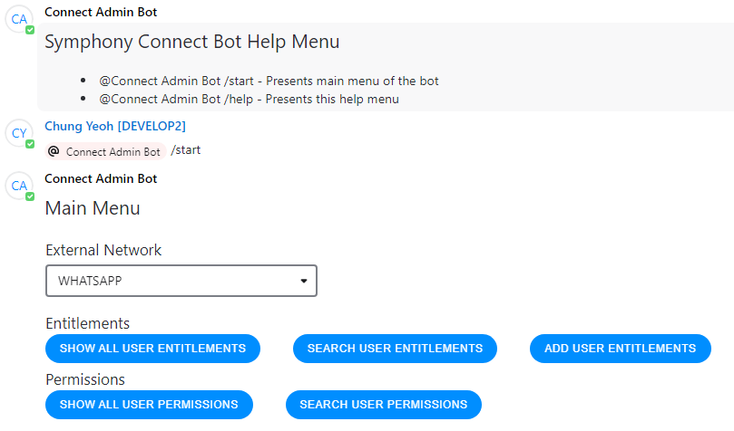

# Symphony Connect Bot V2 Project
The Symphony Connect Bot project uses the Symphony BDK 2.0 for Python.
To get started, follow these commands and steps below:

## First run only:
1. Create virtual environment:
    - `python3 -m venv env`
2. Install dependencies:
    - `pip3 install -r requirements.txt`

## Subsequent runs:
- Activate virtual environment
    - macOS/Linux: `source env/bin/activate`
    - Windows: `env\Scripts\activate.bat`

## Run project
- `python3 -m src`

## Getting Started
### 1 - Prepare RSA Key pair
You will first need to generate a **RSA Public/Private Key Pair**.
- Send the **Public** key to Symphony Support Team in order to set up 
- Private Key will be required in steps below
- In return, Symphony team will provide a publicKeyID which you will need to populate in the config.yaml file below

You will also need to set up a [Symphony Service Account](https://support.symphony.com/hc/en-us/articles/360000720863-Create-a-new-service-account), which is a type of account that applications use to work with Symphony APIs. Please contact with Symphony Admin in your company to get the account.

**RSA Public/Private Key Pair** is the recommended authentication mechanism by Symphony, due to its robust security and simplicity.

### 2 - Upload Service Account Private Key
Please copy the private key file (*.pem) to the **rsa** folder. You will need to configure this in the next step.

Please also upload the private key for Symphony Service Account created above in **rsa** folder.

### 3 - Update resources

To run the script, you will need to configure **config.yaml** in the **resources** directory. You may refer to **sample_config.yaml** file provided as example. 

# Release Notes

## 0.1
- Initial Release
